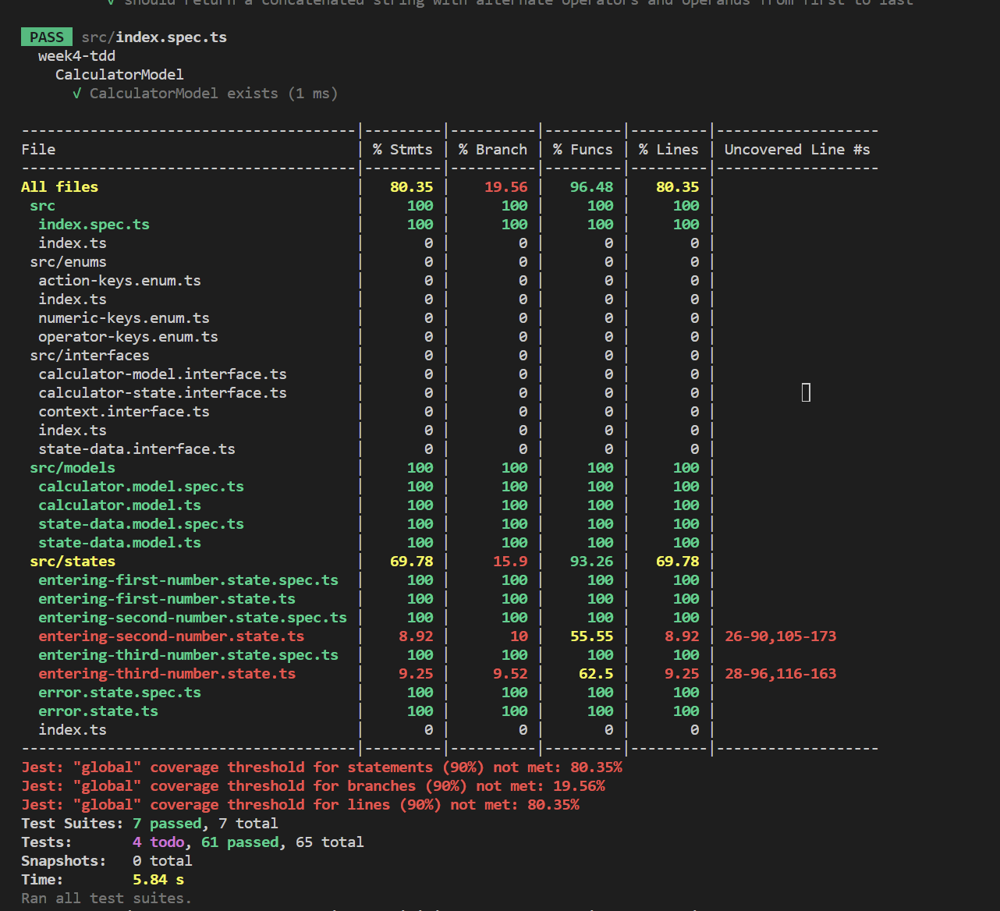
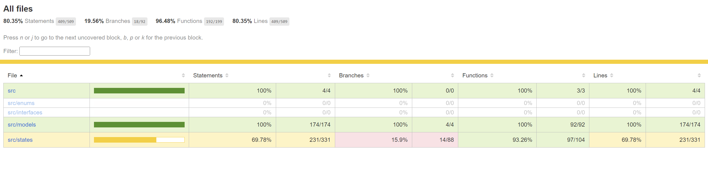
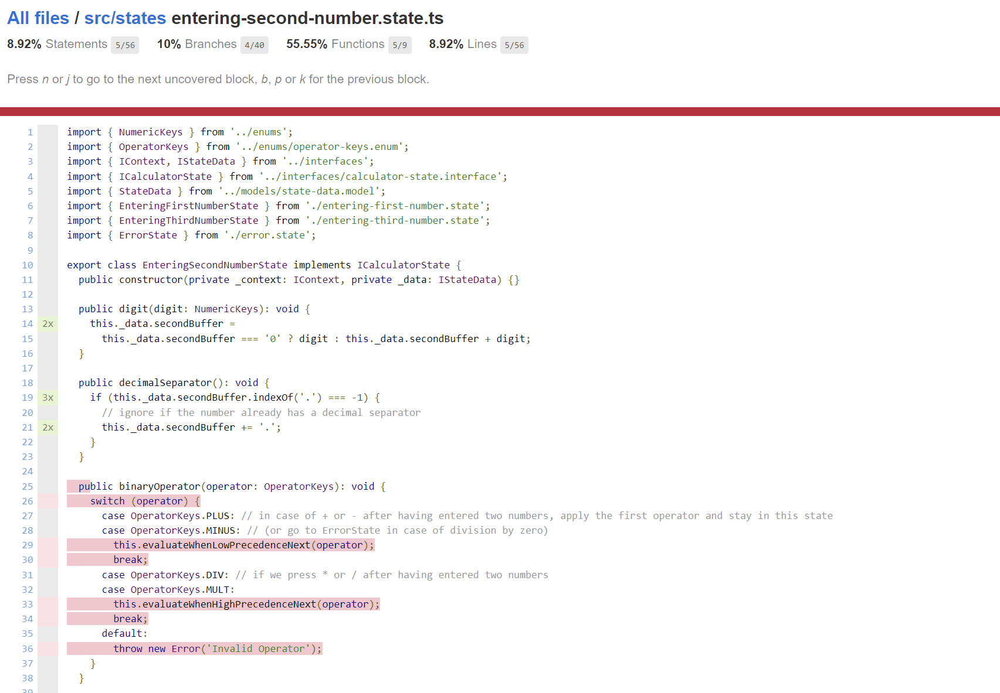

# Week 8 Activity - White Box Testing

Welcome back, fellow Software Engineers!
Last week you helped us find 7 bugs in our calculator implementation.
Your actions have impact, your efforts in the previous activity have forced our developer to write tests!
Staying true to the promise of preparing you for the real world, we have decided to reward your great work with *MORE* work `:)`.

Although the developer put in efforts to write some tests, the branch coverage on your calculator stands at an abysmal 19.5%.
This is simply unacceptable and we are counting on you to save the day once again.

- Your task for today, is to write tests for 2 files and bring the branch coverage up to 80%.

## About the code

*Good News*: You finally get to see the Calculator implemented with the State Design Pattern.
The calculator is the same one we implemented in Week 5.
At this point, you should be familiar with the files, methods, code organization, and scripts and we will not discuss them.
What we haven't discussed so far, however, is test coverage. 
So lets get started on that.
- Run `npm install` in the root of the project.
  - The root of the project is where the README.md and package.json are.
- Run `npm run test`.

You should see the below output:

Some interesting things to note:
- About coverage: 
  - We have more than 80% line, function, and statement coverage, but the branch coverage is only ~20%
  - This indicates that a large portion of our logic is concentrated in a few methods (which are untested).
- About the test summary:
  - `Tests:       4 todo, 61 passed, 65 total` 
  - There are 4 tests marked as TODO.
    - This is a jest feature which allows to create placeholders to implement tests later.

## Your Task

Your task today is to write tests for the 4 `todo` methods.
The methods are `binaryOperator()` and `equals()` in `entering-second-number.state.ts` and `entering-third-number.state.ts`.
The tests are found in the corresponding `.spec.ts` files for the above files.
Withing the spec files, find methods named `it.todo` and replace them with your own test suite to cover all branches.

You can run the tests with `npm run test` once you add more tests.
The html report of the coverage can be found at `reports/coverage/lcov-report/index.html` and looks as below:

You can navigate to difference files in the report to see which branches have not been covered yet:

## Understanding The State Design

The State Design Pattern (for the calculator) revolves around 3 states (and a 4th Error state) and transitioning between them as more information becomes available.

1. Initialization:
  - On init, the calculator is in EnteringFirstNumberState
2. EnteringFirstNumberState
  - In this state, the calculator accepts 1 value in firstBuffer, and 1 operator in firstOperator.
  - When an operator is entered, we transition to EnteringSecondNumberState
3. EnteringSecondNumberState
  - EnteringSecondNumberState accepts 1 value in secondBuffer, and 1 operator in secondOperator.
  - When secondBuffer contains a value and user inputs the next operator
    - if firstOperator is high precedence,
      - evaluate the output of the first operation and store the result in firstBuffer
      - Store the newly entered operator in firstBuffer
      - stay in EnteringSecondNumberState
    - if new operator is low precedence,
      - evaluate the output of the first operation and store the result in firstBuffer
      - Store the newly entered operator in firstBuffer
      - stay in EnteringSecondNumberState
    - if new operator is high precedence,
      - store the operator in secondOperator
      - Transition to EnteringThirdNumberState 
4. EnteringThirdNumberState
  - EnteringThirdNumberState accepts 1 value in thirdBuffer, and 1 new operator.
  - If new operator is high precedence,
    - evaluate second and third buffer and store the result in secondBuffer
    - store the new operator in secondOperator
    - Stay in EnteringThirdNumberState
  - If new operator is low precedence
    - evaluate second and third buffer and store the result in secondBuffer
    - evaluate first and second buffer and store the result in firstBuffer
    - store the new operator in firstOperator
    - Transition to EnteringSecondNumberState

- Evaluate equals somewhat similarly and transition to error state if an invalid operation occurs.

## Submission

In the root directory, run the command `npm run zip`. 
This command will generate a zip file called `submission.zip`.
Upload the `submission.zip` file to Gradescope and tag your partner on Gradescope on the submission.

## Grading

You must achieve 80% branch coverage to receive full credit for this activity.
